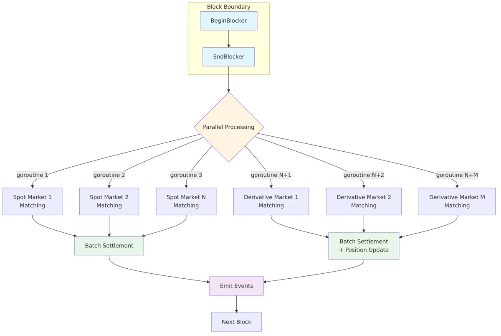
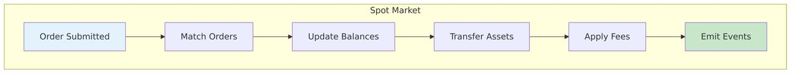
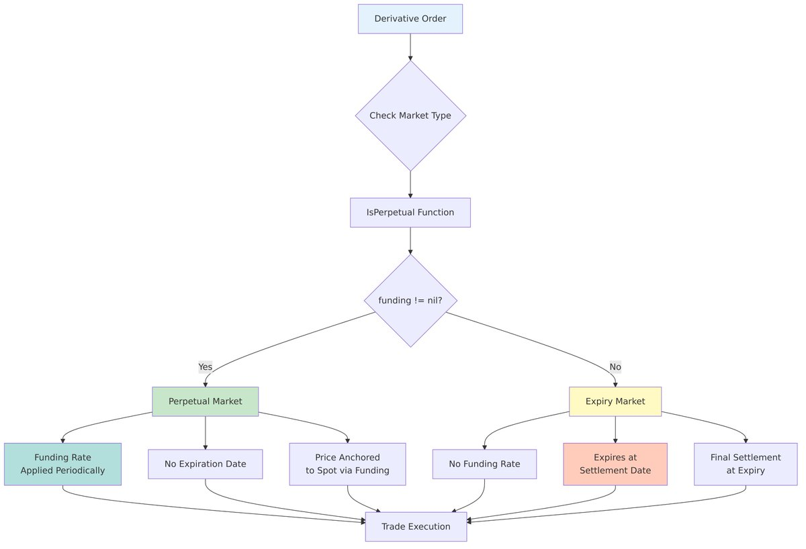
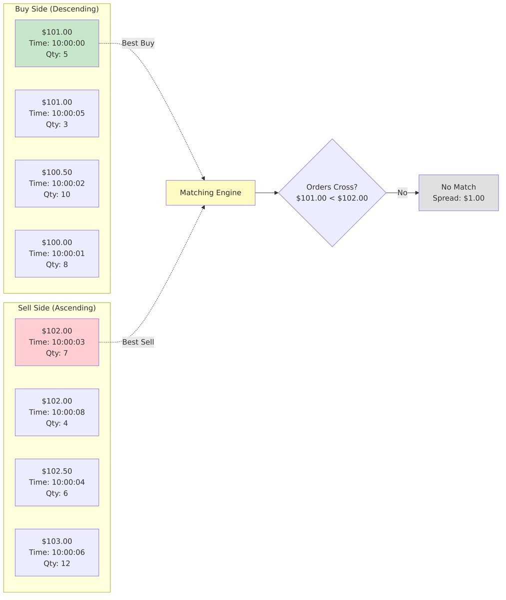
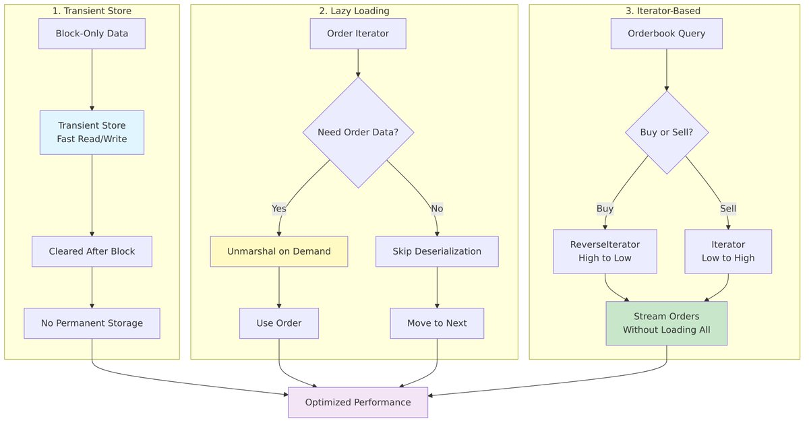

> 📖 This is the condensed version. The full technical deep dive, with the code examples in full, is on Medium: [Deep Dive into Injective's Orderbook Matching Engine](https://kyle-park-io.medium.com/deep-dive-into-injectives-orderbook-matching-engine-57642e67e101) — [한국어판](https://kyle-park-io.medium.com/injective-%EC%98%A4%EB%8D%94%EB%B6%81-%EB%A7%A4%EC%B9%AD-%EC%97%94%EC%A7%84-%EC%8B%AC%EC%B8%B5-%EB%B6%84%EC%84%9D-47dfc279c17d)

---

> **※ CHANGE LOG (2026–02–13)**
A new release version has been added to the changelog and the branch has been changed from **blob/master** to **tree/release/v1.18.x**

## Introduction

How does @InjectiveLabs process thousands of trades per block, fully on-chain, while maintaining CEX-level performance?

In this deep dive, I'll break down Injective's orderbook matching engine - covering both spot and derivatives markets, with actual code references from the GitHub repository.

## Why On-Chain Orderbook is Hard

Traditional exchanges (NYSE, NASDAQ, Binance, Coinbase, Bybit) have used orderbook matching for decades. It's a proven technology for high-frequency trading and professional markets.

But implementing orderbooks ON-CHAIN is extremely challenging:

**Technical Constraints:**

- Block time limits (must process all orders within seconds)
- State complexity (managing thousands of orders)
- Gas costs (expensive on-chain storage)
- Deterministic execution requirements

This is why most DEXs gave up and use **AMM (Automated Market Makers)** instead. It's simply easier to implement swap(x, y) than building a full orderbook system on-chain.

## Injective's Approach

Injective is one of the few protocols that successfully implemented a **fully on-chain orderbook**. Here's what makes it special:

✅ **100% On-Chain**: All matching logic runs on the blockchain, not off-chain sequencers

✅ **Go-based**: Written in Go using Cosmos SDK - easier to learn than Rust

✅ **Spot & Derivatives**: Supports both market types with a unified architecture

✅ **Open Source**: Fully auditable and transparent

**Comparison with other chains:**

- **dYdX V3**: Off-chain orderbook with on-chain settlement
- **Serum (Solana)**: On-chain but uses Rust (steeper learning curve)
- **Vertex Protocol**: Hybrid architecture (off-chain sequencer)

---

## Core Architecture



### Entry Point: ABCI BeginBlocker/EndBlocker

Injective uses Cosmos SDK's ABCI (Application Blockchain Interface) to process all matching at block boundaries.

**Why block boundaries?**

1. Deterministic execution - same input always produces same output
1. Batch processing - handle multiple orders efficiently
1. Parallel execution - each market can be processed independently

📍 Code: [`abci.go:84-146`](https://github.com/InjectiveFoundation/injective-core/blob/master/injective-chain/modules/exchange/abci.go#L84-L146)

The EndBlocker processes spot and derivatives markets in parallel using goroutines:

```go
// Process spot markets
for idx := range spotMarkets {
    go func(marketIdx int) {
        processSpotMarket(ctx, spotMarkets[marketIdx])
    }(idx)
}

// Process derivatives markets
for idx := range derivativeMarkets {
    go func(marketIdx int) {
        processDerivativeMarket(ctx, derivativeMarkets[marketIdx])
    }(idx)
}
```

This parallel execution is key to achieving high throughput.

---

## Spot vs Derivatives Markets

### Spot Markets



Spot markets are straightforward: direct exchange of two assets.

**Key structure:**

```go
type SpotMarket struct {
    Ticker       string
    BaseDenom    string  // Asset being traded
    QuoteDenom   string  // Price currency
    MakerFeeRate Dec
    TakerFeeRate Dec
}
```

📍 Code: [`market.pb.go:260`](https://github.com/InjectiveFoundation/injective-core/blob/master/injective-chain/modules/exchange/types/v2/market.pb.go#L260)

### Derivatives Markets

Derivatives are more complex, supporting perpetual futures and expiry futures with leverage, positions, and funding rates.

**Key structure:**

```go
type DerivativeMarket struct {
    Ticker              string
    QuoteDenom          string
    OracleBase          string
    OracleQuote         string
    IsPerpetual         bool    // 🔑 Key parameter
    InitialMarginRatio  Dec
    MaintenanceMarginRatio Dec
}
```

📍 Code: [`market.pb.go:479`](https://github.com/InjectiveFoundation/injective-core/blob/master/injective-chain/modules/exchange/types/v2/market.pb.go#L479)

---

**Perpetual vs Expiry Futures:**



The distinction is made through the \`IsPerpetual()\` function:

```go
func (b *DerivativeLimitOrderbook) IsPerpetual() bool {
    return b.funding != nil
}
```

📍 Code: [`derivative_limit_orderbook.go:201-203`](https://github.com/InjectiveFoundation/injective-core/blob/master/injective-chain/modules/exchange/keeper/derivative_limit_orderbook.go#L201-L203)

- **Perpetual**: Has funding rate mechanism (funding != nil)
- **Expiry**: No funding, expires at specific date

---

## The Matching Algorithm: Price-Time Priority



Injective implements the **Price-Time Priority** algorithm - the same algorithm used by traditional exchanges worldwide.

**How it works:**

1. **Better price wins**: Buy orders sorted high→low, Sell orders sorted low→high
1. **Time priority**: For orders at the same price, earlier orders fill first
1. **Partial fills**: Orders can be partially filled across multiple matches

📍 Code: [`spot_limit_order_matcher.go:166-192`](https://github.com/InjectiveFoundation/injective-core/blob/master/injective-chain/modules/exchange/keeper/ordermatching/spot_limit_order_matcher.go#L166-L192)

```go
func (o *SpotLimitOrderbook) advanceNewOrder(
    newOrder *SpotOrder,
    clearingPrice, clearingQuantity Dec,
) {
    // Sort by price level
    priceLevel := o.getOrCreatePriceLevel(newOrder.Price)

    // Add to end of queue (time priority)
    priceLevel.orders = append(priceLevel.orders, newOrder)
}
```

---

## Clearing Price Calculation

### Spot Markets

For spot markets, the clearing price is simply the midpoint between the best buy and sell orders.

📍 Code: [`spot_limit_order_processor.go:94-113`](https://github.com/InjectiveFoundation/injective-core/blob/master/injective-chain/modules/exchange/keeper/spot_limit_order_processor.go#L94-L113)

```go
if lastBuyPrice.LTE(midMarketPrice) {
    return lastBuyPrice
}
if lastSellPrice.GTE(midMarketPrice) {
    return lastSellPrice
}
return midMarketPrice
```

### Derivatives Markets: Mark Price Fallback

Derivatives markets use a more sophisticated approach with **mark price fallback** to prevent manipulation:

📍 Code: [`derivative_orders_processor.go:30-44`](https://github.com/InjectiveFoundation/injective-core/blob/master/injective-chain/modules/exchange/keeper/derivative_orders_processor.go#L30-L44)

```go
func GetRegularClearingPrice(
    lastBuyPrice, lastSellPrice, markPrice Dec,
    midMarketPrice *Dec,
) Dec {
    // Basic logic
    if lastBuyPrice.LTE(*midMarketPrice) {
        return lastBuyPrice
    }
    if lastSellPrice.GTE(*midMarketPrice) {
        return lastSellPrice
    }

    // Fallback to oracle mark price
    if !markPrice.IsNil() {
        return GetOracleFallBackClearingPrice(
            lastBuyPrice, lastSellPrice, markPrice
        )
    }

    return *midMarketPrice
}
```

This prevents price manipulation in thin markets by falling back to oracle-based mark prices.

---

## Order Matching Process

### Limit Order Matching

Limit orders are matched against the resting orderbook:

📍 Code: [`spot_limit_order_processor.go:65-92`](https://github.com/InjectiveFoundation/injective-core/blob/master/injective-chain/modules/exchange/keeper/spot_limit_order_processor.go#L65-L92)

```go
for {
    // Get best orders from both sides
    buyOrder := buyOrderbook.Peek()
    sellOrder := sellOrderbook.Peek()

    // Check if orders cross
    if buyOrder.Price < sellOrder.Price {
        break  // No match
    }

    // Fill orders
    fillQuantity := min(buyOrder.Quantity, sellOrder.Quantity)
    buyOrderbook.Fill(fillQuantity)
    sellOrderbook.Fill(fillQuantity)
}
```

### Market Order Matching

Market orders are matched immediately at the best available prices:

📍 Code: [`spot_limit_order_processor.go:151-181`](https://github.com/InjectiveFoundation/injective-core/blob/master/injective-chain/modules/exchange/keeper/spot_limit_order_processor.go#L151-L181)

Market orders consume liquidity from the orderbook until fully filled or liquidity is exhausted.

---

## Derivatives-Specific Logic

### Position Management

Derivatives markets track positions for each trader:

📍 Code: [`derivative_limit_orderbook.go:334-382`](https://github.com/InjectiveFoundation/injective-core/blob/master/injective-chain/modules/exchange/keeper/derivative_limit_orderbook.go#L334-L382)

```go
// Check if order closes existing position
isClosingPosition := position != nil &&
    order.IsBuy() != position.IsLong &&
    position.Quantity.IsPositive()

if isClosingPosition {
    // Reduce position
    closeQuantity = min(order.Quantity, position.Quantity)
} else {
    // Open or increase position
    // Check margin requirements
    requiredMargin = calculateMargin(order.Quantity, order.Price)
}
```

### Funding Rate Application (Perpetuals Only)

For perpetual markets, funding rates are applied periodically:

📍 Code: [`derivative_limit_orderbook.go:215-217`](https://github.com/InjectiveFoundation/injective-core/blob/master/injective-chain/modules/exchange/keeper/derivative_limit_orderbook.go#L215-L217)

```go
if b.IsPerpetual() {
    b.applyFunding(ctx, positions)
}
```

Funding rates balance long/short interest and keep perpetual prices anchored to spot.

---

## Settlement Process

### Spot Settlement

📍 Code: [`spot_execution_limit.go:129-196`](https://github.com/InjectiveFoundation/injective-core/blob/master/injective-chain/modules/exchange/keeper/spot_execution_limit.go#L129-L196)

1. Update account balances (base and quote assets)
1. Apply fees (maker/taker)
1. Transfer assets between accounts
1. Emit trade events
1. Update trading reward points

### Derivatives Settlement

📍 Code: [`derivative_execution_market.go:67-139`](https://github.com/InjectiveFoundation/injective-core/blob/master/injective-chain/modules/exchange/keeper/derivative_execution_market.go#L67-L139)

1. **Check market solvency** (insurance fund check)
1. **Update positions** (increase/decrease/close)
1. **Apply funding** (perpetuals only)
1. **Check margin requirements** (trigger liquidations if needed)
1. **Calculate PnL** (realized/unrealized)
1. **Update account deposits**
1. **Emit events**

Derivatives settlement is significantly more complex due to leverage, positions, and risk management.

---

## Performance Optimizations



**1. Transient Store**

Block-only data is stored in transient store (cleared after block):

📍 Code: [`orderbook.go:30-52`](https://github.com/InjectiveFoundation/injective-core/blob/master/injective-chain/modules/exchange/keeper/orderbook.go#L30-L52)

**2. Lazy Loading**

Orders are only deserialized when needed:

📍 Code: [`derivative_limit_orderbook.go:502-524`](https://github.com/InjectiveFoundation/injective-core/blob/master/injective-chain/modules/exchange/keeper/derivative_limit_orderbook.go#L502-L524)

```go
func (b *DerivativeLimitOrderbook) getRestingOrder() *DerivativeLimitOrder {
    if b.getRestingFillableQuantity().IsZero() {
        var order DerivativeLimitOrder
        bz := b.restingOrderIterator.Value()

        // Unmarshal only when needed
        b.k.cdc.MustUnmarshal(bz, &order)

        b.restingOrderIterator.Next()
        b.restingOrderbookFills = &order
    }
    return b.restingOrderbookFills
}
```

This minimizes memory usage and deserialization overhead.

**3. Iterator-Based Traversal**

📍 Code: [`orderbook.go:204-265`](https://github.com/InjectiveFoundation/injective-core/blob/master/injective-chain/modules/exchange/keeper/orderbook.go#L204-L265)

Uses Cosmos SDK iterators to traverse orderbook without loading all orders into memory:

```go
if isBuy {
    iterator = ordersStore.ReverseIterator(nil, nil)  // High to low
} else {
    iterator = ordersStore.Iterator(nil, nil)         // Low to high
}
```

---

## Why This Matters

Injective proves that you CAN build a high-performance orderbook DEX fully on-chain:

✅ **Transparent**: All matching logic is verifiable on-chain

✅ **Decentralized**: No central servers or off-chain sequencers

✅ **CEX-level features**: Leverage, perpetuals, funding rates, liquidations

✅ **Open source**: Anyone can audit the code

✅ **Go-based**: More accessible than Rust for developers

**Key Innovations:**

- Parallel market execution for high throughput
- Sophisticated derivatives support (perpetuals + expiry)
- Performance optimizations (transient store, lazy loading, iterators)
- Battle-tested on mainnet with real trading volume

---

## Learn More

📖<strong> Full Technical Deep Div</strong>e: [Medium Article Link](https://medium.com/@kyle-park-io/deep-dive-into-injectives-orderbook-matching-engine-57642e67e101)

🔗<strong> GitHub Repositor</strong>y: [injective-core](https://github.com/InjectiveFoundation/injective-core)

📂<strong> Exchange Modul</strong>e: [modules/exchange](https://github.com/InjectiveFoundation/injective-core/tree/master/injective-chain/modules/exchange)

📚<strong> Official Doc</strong>s: [docs.injective.network](https://docs.injective.network/)

---

**Written by**: Kyle

- Medium: [@kyle-park-io](https://medium.com/@kyle-park-io)
- X: [@bcd_kyle](https://x.com/bcd_kyle)
- Telegram: [@kyleparkio](https://t.me/kyleparkio)

**Tags**: #Injective #DeFi #Blockchain #Orderbook #Cosmos #OnChain

**Mention**: @InjectiveLabs
