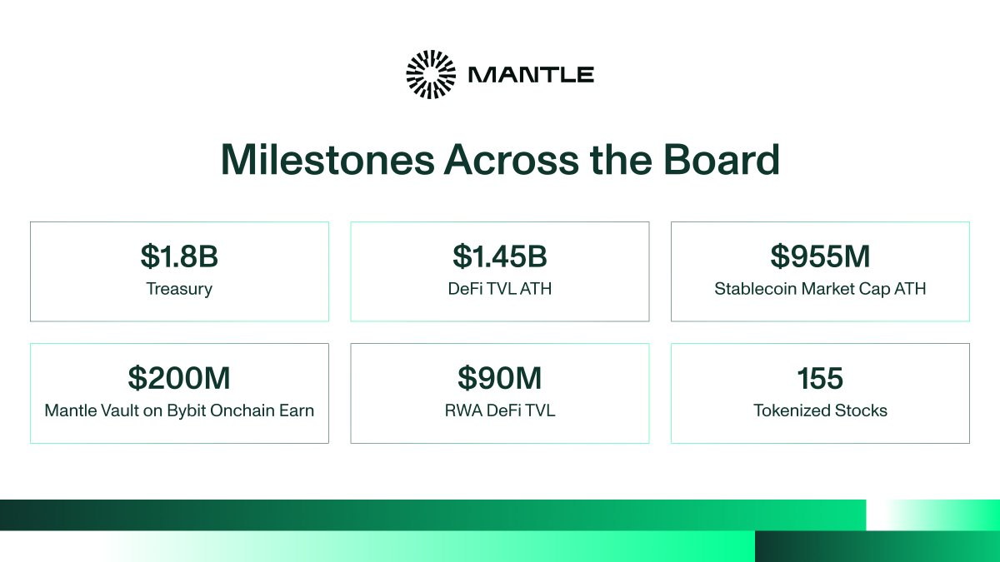

많은 것이 동시에 맞물려야 했고, 상반기에 실제로 그렇게 됐습니다.

전 세계 자산을 온체인으로 가져오고, 실물 금융이 흐르는 곳으로 자본을 이동시키는 것. 그것이 비전이었고, 이번 상반기는 그 비전이 더 이상 구상에 머물지 않고 하나의 금융 시스템으로 작동하기 시작한 시기였습니다.

6월까지 155개의 토큰화 주식이 맨틀에서 24시간 거래됐습니다. 역사상 최대 규모의 IPO가 상장 당일 온체인에 올랐습니다. $MNT는 Mantle Super Portal을 통해 @solana로 확장됐습니다. AI 에이전트는 검증 가능한 신원을 바탕으로 거래를 정산했습니다.

이 자산들은 글로벌 시장에 열렸고, 풍부한 디파이 유동성과 Bybit로 이어지는 직접 파이프라인, 그리고 실제로 작동하는 에이전트 경제를 통해 하나로 맞물려 활용됐습니다.

이 모든 것이 어떻게 이루어졌는지 소개합니다.

## 맨틀의 상반기를 정의한 최고 기록들

전 부문에 걸친 다수의 역대 최고치:

- **디파이 TVL 역대 최고치 경신, 온체인 10억 달러 돌파**
- **RWA 디파이 TVL 9,000만 달러**
- **스테이블코인 시가총액 9억 5,500만 달러로 역대 최고치, 전년 대비 120% 증가**
- **Bybit Onchain Earn의 Mantle Vault에 2억 달러 이상**
- **155개 토큰화 주식 지원**
- **트레저리 규모 18억 달러 이상**

스테이블코인, 토큰화 주식, 볼트 예치금은 이제 맨틀 온체인 경제의 핵심을 이루며, 자본이 실제로 활용되는 장의 자산 구성을 보여줍니다.

## 토큰화 주식의 거점, 맨틀

이번 상반기의 핵심 주제입니다. 전통 시장의 대표 종목들이 상장 당일부터 온체인에 등장하기 시작했고, 상반기가 끝날 무렵에는 우량주부터 역사상 최대 IPO까지 155개의 토큰화 주식이 맨틀에서 거래됐습니다.

**SpaceX, 첫날부터 온체인.** 토큰화된 @SpaceX($SPCXx)는 역사상 최대 규모의 IPO였던 상장 당일 맨틀에 올랐습니다. 몇 주 뒤에 나온 래핑 자산이 아니라, 바로 그날이었습니다. 이는 여러 사례 중 첫 번째였으며, 올해 최대 규모의 상장들이 아직 남아 있습니다.

**프랭클린 템플턴 ETF, 온체인.** @FTI\_US의 토큰화 Franklin U.S. Equity Index ETF인 $USPXx는 미국 주식시장 상위 85%를 추종하는 약 20억 달러 규모의 펀드로, @nvidia·@Microsoft 같은 종목에 단일 토큰으로 노출됩니다.

@xStocksFi가 발행하고 @Fluxion\_network에서 24시간 거래되는 이 상품을 통해, 맨틀은 주요 자산운용사의 ETF를 온체인에 올린 최초의 이더리움 L2 중 하나가 됐습니다.

이 모든 것은 세 단계에 걸쳐 구축된 맨틀 레일 위에서 이루어졌습니다:

- **1단계(2026년 4월):** @xStocksFi가 @flowdesk\_co의 지원을 받아 맨틀에서 출시됐으며, 미국 대표 주식 10종을 @Fluxion\_network을 통해 24시간 거래 및 유동성 공급할 수 있게 됐습니다. Bybit는 맨틀에서 입출금을 전면 지원합니다.
- **2단계(2026년 5월):** xChange가 Fluxion을 통해 xStocks의 Atomic RFQ를 맨틀에서 가동했습니다. RFQ를 통해 거래는 발행자로부터 실시간 시장 호가에 직접 발행·상환되며, 슬리피지와 부분 체결 없이 발행·거래·상환의 전 주기를 완결합니다.
- **3단계(2026년 6월):** xPoints가 시작됐습니다. Fluxion에서 xStocks를 거래하면 100만 Fluxion 포인트가 추가로 제공되고, 보유 시 xPoints가 매일 적립되며, 유동성을 공급하면 두 가지를 모두 받을 수 있습니다.

상반기 말 기준으로 @xStocksFi는 @Bybit\_Official과 @Alpha\_Bybit 전반에 걸쳐 온체인으로 유통됐습니다.

## Mantle x Aave 효과

역사상 맨틀만큼 빠르게 성장한 Aave 마켓은 드뭅니다. @aave V3가 2월 11일 출시된 뒤, 단 6주 만에 Aave 최대 마켓 중 하나로 성장했습니다:

- 첫 2주간 5억 5,000만 달러 이상.
- 출시 18일 만인 3월 1일 10억 달러 돌파.
- 3월 20일 13.4억 달러로, Plasma·Ethereum 같은 선두 마켓에 이어 전 세계 3번째로 큰 Aave 마켓에 등극.
- 4월까지 총예치금 14.5억 달러 이상.

이 순위가 핵심입니다. 총 대출·차입 기준으로 맨틀은 업계 거의 모든 체인을 앞섭니다. 이를 뒷받침한 요소는 다음과 같습니다:

- **Bybit 플라이휠:** 첫날부터 CeFi에서 온체인 대출로 이어지는 풍부한 유동성 라우팅.
- **완결된 자산 스택:** @USDT0\_to, @ethena의 $USDE, @FunctionBTC의 FBTC, @maplefinance의 syrupUSDT, @KelpDAO의 $wrsETH 등.
- 체인 전반에서 맨틀의 디파이 TVL은 6개월간 230% 이상 성장하며, @DefiLlama 기준 처음으로 다수의 주요 L1을 넘어섰습니다.

## 하나의 RWA 파이프라인: Mantle & Bybit

선정된 @Bybit\_Official 현물 상장 종목은 이제 상장되는 즉시 @Fluxion\_network을 통해 온체인에 올라, 자산이 첫날부터 거래소와 온체인 유동성을 모두 확보합니다.

이 파이프라인이 실제로 작동함을 가장 분명하게 보여주는 것은 그 위에 구축된 볼트입니다:

- **Mantle Vault**(@CIAN\_protocol 기반)는 1월 초 운용자산(AUM) 1억 달러 이상을 기록한 뒤, 3월 31일 2억 달러 이상으로 두 배 성장했습니다.
- Aave와 CIAN Protocol을 통해 맨틀에서 운용되며, CeFi 유동성을 하나의 상품 안에서 온체인 수익으로 전환합니다.

@Alpha\_Bybit를 통한 동시 상장은 거래소와 온체인에 자산을 한 번에 유통해, 유동성과 라우팅이 함께 도착하도록 합니다.

맨틀과 Bybit에 동시에 상장된 자산:

- @HeyElsaAI의 $ELSA, 디파이 AI를 위한 유동성.
- @BlockSt\_HQ의 $BSB, Fluxion에서의 온체인 거래 및 유동성.
- @OpenGradient의 $OPG, 검증 가능한 AI를 위한 유동성.
- @billions\_ntwk의 $BILL, Bybit 현물과 병행해 Fluxion에서 거래.

그리고 Bybit 및 Bybit Alpha 전반:

- @worldlibertyfi의 $USD1, Bybit와 맨틀 온체인 풀에서 거래되는 트레저리 기반 달러 스테이블코인.
- @tethergold의 XAU₮, 맨틀 레일 위의 볼트 기반 토큰화 금.

## $MNT, 여러 체인에서 상호운용

자본은 여러 체인을 넘나들며 움직이고, $MNT도 그와 함께 움직입니다. 상반기에 $MNT는 단일 생태계 자산에서 벗어났습니다. Mantle Super Portal을 통해 $MNT는 @solana로 확장돼, @byreal\_io 같은 제품과 DEX에서 사용할 수 있게 됐습니다.

앞서 이루어진 @LayerZero\_Core·@HyperliquidX 연동과 함께, 이제 $MNT는 하나의 프레임워크를 통해 이더리움, 솔라나, 그리고 그 너머로 확장됩니다.

- **솔라나에서 가동:** @byreal\_io는 출시 30일 이내에 첫 달 동안 활발한 거래와 함께 1,300만 달러 이상의 TVL을 유지했습니다.
- **강화된 보안:** $MNT OFT는 3/3 DVN 구성으로 운영되며, @Nethermind가 DVN 노드로 추가돼 검증 기준을 높였습니다.

## RWAi: 두 경제가 맨틀에서 수렴하는 지점

자산의 이면에서, 상반기는 두 경제를 위한 레일을 동시에 놓는 시기였습니다. 오늘의 실물 금융, 그리고 온체인에서 형성되고 있는 자율 에이전트 경제입니다.

**실물 금융을 위한 정산 기반:** @ethereum 블롭으로 업그레이드하고 Validium에서 완전한 이더리움 ZK 롤업으로 전환해, 이제 모든 거래를 이더리움 자체에서 검증할 수 있습니다.

이더리움 수준의 보안을, 맨틀이 구현하는 속도와 낮은 수수료로 제공합니다.

**에이전트 경제를 위한 최초의 풀스택:** 대부분의 네트워크가 아직 에이전트에 무엇이 필요한지 논의하는 동안, 맨틀은 표준이 등장하는 대로 이를 채택하며 결제·신원·커머스·툴링에 걸친 전체 스택을 구축했습니다:

- **결제:** @questflow를 통한 x402 퍼실리테이터로, 자율 에이전트 간 결제를 지원.
- **신원:** ERC-8004(Trustless Agents)이 2026년 2월 맨틀에서 가동돼, AI 에이전트에 검증 가능한 온체인 신원과 이동 가능한 평판을 부여하고, 이들을 TradFi·RWA·온체인 시장 전반의 경제 참여자로 만들었습니다.
- **커머스:** 2026년 3월 @virtuals\_io와 함께 ERC-8183을 채택해, 신뢰 없이 작동하는 에이전트 커머스의 개방형 표준을 맨틀에 도입.
- **툴링:** Mantle AI Agent Skills와 Agent Scaffold가 가동돼, 빌더에게 에이전트를 구축하고 연결할 구성 요소를 제공.

@AlloraNetwork는 온체인에서 거래하는 에이전트를 위해 수익·유동성 관리 전반에 걸친 예측형 AI를 추가했습니다. 더 넓은 에이전트 진영에는 @HeyElsaAI, @elfa\_ai, @Infinit\_Labs, @QuackAI\_AI, @pieverse\_io 등이 포함됩니다.

이를 통해 기관과 RWA를 위한 기반이, 그 위에서 에이전트 경제가 작동할 신원·커머스 표준과 함께 마련됩니다.

## 맨틀 생태계를 움직이는 프로토콜들

이를 구축하는 팀 없이는 어떤 것도 출항할 수 없습니다. 상반기에 맨틀의 금융 스택을 사람들이 실제로 사용하는 것으로 만든 프로토콜들입니다:

- **@Fluxion\_network** - RWA 확장을 뒷받침하는 디파이 실행 엔진으로, 토큰화 자산이 Atomic RFQ와 AMM을 통해 24시간 거래됩니다. 현재 예측시장을 위해 @InsightXHQ와 연동됐습니다.
- **@MerchantMoe\_xyz** - 핵심 현물 DEX이자 토큰화 IPO 상장을 뒷받침한 유동성 기반. $SPCXx 거래와 유동성 공급을 시작했으며, Project X를 통해 $MNT 리워드를 강화했습니다.
- **@MantleIndexFour** - 규제된 래퍼 안에 담긴 기관용 크립토 베타: BTC, ETH, SOL, 그리고 수익까지, 커스터디도 토큰 선별도 필요 없습니다. 운용자산 1억 4,800만 달러로, 온체인 최대의 비(非)MMF 토큰화 펀드입니다.
- **@mETHProtocol** - 기관 규모를 위해 설계된 리퀴드 스테이킹 수익 레이어; TVL 3억 5,800만 달러.
- **@Infinit\_Labs와 @agnidex** - 실제 운영 중인 prompt-to-DeFi: 자연어 프롬프트로 Aave와 @lifiprotocol 전반에서 스왑·예치·대출을 실행합니다.
- **@InsightXHQ** - 맨틀 최초의 AI 네이티브 예측시장: 실시간 스포츠·크립토·뉴스를 거래 가능한 시장으로 전환합니다. 가스비 없이 온체인 영수증과 실시간 가격으로 제공되며, 거래량 1억 달러 이상을 넘어섰습니다.

Mantle Prediction Cup은 6,000달러 상금 풀의 4주간 월드컵 캠페인과 함께, Fluxion을 통한 아메리카 대 유럽 인덱스 마켓을 운영합니다.

## 맨틀의 빌더·개발자 저변을 전 세계로 확장

이 파이프라인은 새로운 빌더들로 움직이며, 상반기의 대표 이벤트는 이들을 발굴하기 위해 마련됐습니다.

**Turing Test 해커톤** - 맨틀에서 에이전트를 구축하는 출발점으로, 자율 에이전트와 인간 빌더가 모두 온체인에서 경쟁했습니다. 1단계 ClawHack에서 5월 1일 2단계 AI 어웨이크닝으로 이어졌습니다.

- 6개 트랙에 걸친 10만 달러 상금 풀
- 전 세계 빌더로부터 500건 이상의 출품작
- 서울(빌더 100명 이상), 홍콩, 마이애미, 호치민을 포함한 10곳 이상의 오프라인 행사 및 해커 하우스
- @AnimocaBrands, @nansen\_ai, @hashed\_official, @tencentcloud, @DoraHacks, @virtuals\_io를 포함한 50곳 이상의 스폰서 및 심사위원
- 7월 2일부터 3일까지 열린 데모데이에 앞서, 120개 프로젝트가 커뮤니티 투표 대상으로 선정

이는 상반기 초 2,000명 이상의 빌더, 500건 이상의 출품작, 15만 달러 상금으로 마무리된 Mantle Global Hackathon을 기반으로 했습니다.

해커톤 외에도, 네 가지 프로그램이 빌더와 크리에이터의 활동을 이어갔습니다:

- Decode Mantle Vaults
- Mantle Squad Bounty
- SuperMantle Creator Arena
- Mantle Research Challenge(진행 중)

## 중요한 모든 곳에서: 현장의 맨틀

온체인 네트워크가, 상반기에 중요했던 모든 무대에 직접 모습을 드러냈습니다.

- **Consensus Miami:** Mantle Squad와 함께한 RWA 마스터클래스, 그리고 RWA의 다음 유통 레이어로서의 AI 에이전트를 주제로 한 House of AI 강연.
- **Solana Accelerate(APAC 및 마이애미):** @byreal\_io·@emilyRioFreeman와 함께한 부스 및 파이어사이드 챗, @vibhu·@joshuacheong 등이 참여한 기관 도입 패널.
- **Consensus Hong Kong(@consensus\_hk):** 전 세계 창업자·빌더·크리에이터가 모인 Mantle RWA Day.
- **@MetaMask Builder Nights, 마이애미:** 맨틀에서 개발 중인 빌더들과의 직접 대화.
- **해커 하우스:** 10곳 이상의 Turing Test 오프라인 행사와 함께한 서울과 호치민.

## 2026년 상반기를 정의한 결정적 순간들

- **1월 9일, CeFi 규모의 온체인 수익:** Mantle Vault가 CIAN Protocol을 기반으로 Bybit Onchain Earn에서 TVL 1억 달러 이상을 돌파.
- **1월 27일, $MNT 상호운용 시작:** $MNT가 Mantle Super Portal을 통해 @solana에서 가동.
- **2월 12일, 에이전트에 신원 부여:** ERC-8004이 배포돼 Trustless Agents를 맨틀에 도입.
- **2월 13일, 빌더 활성화:** Mantle Global Hackathon이 500건 이상의 출품작, 2,000명 이상의 빌더, 15만 달러 상금으로 마무리.
- **2월 11일\~3월 1일, Aave 스피드런:** 총 대출·차입이 18일 만에 8억 달러에서 10억 달러로 상승.
- **3월 9일\~10일, 두 건의 역대 최고치:** 스테이블코인 시가총액이 9억 5,500만 달러로 역대 최고치를 기록하고, 디파이 TVL이 10억 달러를 돌파.
- **3월 13일, 에이전트 툴링:** Mantle AI Agent Skills와 Agent Scaffold 가동.
- **3월 19일, Aave 상위 3위:** 맨틀이 13.4억 달러를 확보하며 3번째로 큰 Aave 마켓에 등극.
- **3월 27일, 에이전트 커머스:** Virtuals Protocol과 함께 ERC-8183 채택.
- **3월 31일, 볼트 두 배 성장:** Mantle Vault가 TVL 2억 달러 이상 돌파.
- **4월 10일, 토큰화 주식 온체인:** xStocks 1단계로 미국 대표 토큰화 주식 10종 가동.
- **5월 1일, AI 어웨이크닝:** Turing Test 해커톤 2단계 가동, 6개 트랙에 걸쳐 10만 달러.
- **5월 5일\~7일, 글로벌 무대:** Consensus Miami, Solana Accelerate, MetaMask Builder Nights를 한 주에 모두 진행.
- **5월 7일, 기관용 체결:** xStocks의 xChange가 Atomic RFQ와 함께 가동.
- **6월 12일, SpaceX 온체인:** 토큰화 SpaceX($SPCXx)가 맨틀에 상장.
- **6월 23일, 프랭클린 ETF 온체인:** 미국 주식시장의 약 20억 달러 규모를 차지하는 프랭클린 $USPXx ETF 가동.
- **6월 24일, AI 네이티브 예측시장:** InsightX가 거래량 1억 달러 이상을 돌파.
- **6월 25일, 홀더를 위한 리워드:** @xStocksFi의 xPoints 가동.

2월의 에이전트 신원부터 6월의 토큰화 주식·예측시장까지, 2026년 상반기는 맨틀이 RWA 전략에서 대규모 실행으로 전환한 시기였습니다.

## 맨틀이 나아갈 방향

상반기는 전 세계 자산이 온체인에 오르고, 그 배후의 자본이 글로벌 시장 전반에서 거래·대출되고 수익을 내며 실제로 활용된 시기였습니다.

2026년 하반기의 우선순위:

- **더 많은 전 세계 자산을 맨틀로**
- **그 자본을 더 다양한 방식으로 활용**
- **기관과 발행자를 더 가까이**
- **에이전트 경제의 성숙**

아직 밝히지 않은 내용이 더 있으며, 앞으로 구축할 것도 훨씬 많습니다.

하반기를 향해 나아갑니다.
