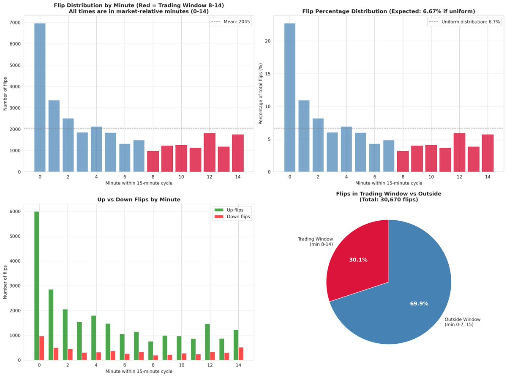
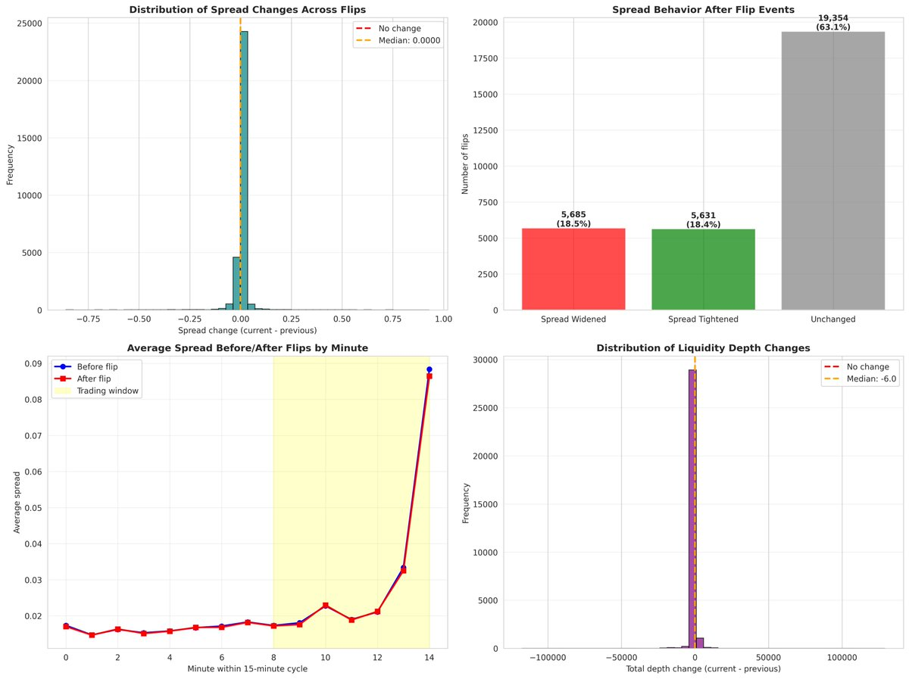
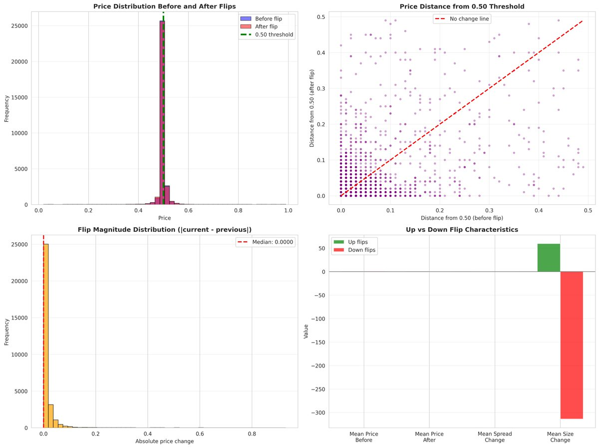
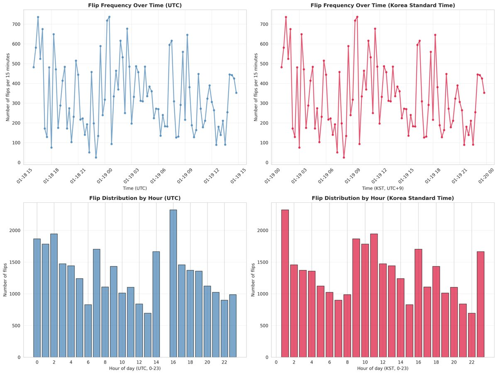

## Abstract

This article demonstrates how to analyze real-time WebSocket stream data from Polymarket's 15-minute markets over a \~23-hour observation period. We focus specifically on **Flip events**—moments when prices cross the 0.50 threshold—examining data quality, timing patterns, and liquidity dynamics.

**Dataset:** 30,670 flip events from BTC, ETH, SOL, XRP markets (2026-01-18 16:00 to 2026-01-19 15:00 UTC, 23 hours)

## 0. Choosing Your Analysis Time Window

You can freely select different time windows based on your research objectives. This study uses \~23 hours as an example, but your choice should align with what you want to discover:

- **Short windows (1h, 4h):** Best for identifying high-frequency patterns and intraday volatility
- **Medium windows (1d, 1w):** Suitable for establishing baseline behavior and comparing different trading sessions
- **Long windows (1M+):** Ideal for strategy validation across multiple market regimes and robustness testing

There is no "correct" window—only appropriate windows for specific research questions. Choose based on whether you're analyzing patterns, testing strategies, or validating long-term behavior.

## 1. WebSocket Streaming Challenges

When consuming real-time orderbook data via WebSocket, be aware of these potential issues:

- **Out-of-order delivery:** Messages may arrive non-sequentially
- **Duplicate messages:** Same orderbook state transmitted multiple times
- **Clock skew:** Server and client timestamps may diverge
- **Silent disconnections:** Connections can drop without notification

Consider implementing hash-based deduplication, dual timestamp recording, automatic reconnection with exponential backoff, and heartbeat monitoring (PING/PONG) to handle these challenges.

**Protocol References:**

- WebSocket (RFC 6455)
- TCP (RFC 793)
- NTP (RFC 5905)

## 2. What is a Flip Event?

## 2.1 Definition

In Polymarket's 15-minute binary prediction markets (UP/DOWN tokens), the **0.50 price level** represents maximum uncertainty—a 50% probability for either outcome. A **flip event** occurs when the market price crosses this critical threshold:

- **Up flip (rising flip):** Price moves from ≤0.50 to \>0.50 (market sentiment shifts toward UP)
- **Down flip (falling flip):** Price moves from ≥0.50 to \<0.50 (market sentiment shifts toward DOWN)

## 2.2 Why Flips Matter

Flip events represent **decisive moments** where market consensus changes direction. They signal:

1. **Sentiment reversal:** The majority opinion has switched sides
1. **Trading opportunity:** Sharp price movements often accompany flips
1. **Market uncertainty:** The 0.50 threshold is where information is most equally distributed

## 3. Research Findings

## Dataset Overview

```shell
Total flip events:              30,670
Date range (UTC):               2026-01-18 16:00 to 2026-01-19 15:00 (23 hours)
Date range (KST):               2026-01-19 01:00 to 2026-01-20 00:00 (23 hours)
Assets:                         BTC, ETH, SOL, XRP
Markets:                        92 unique 15-minute markets
Timezone:                       All timestamps stored in UTC, converted to KST (UTC+9) for analysis
```

## 3.1 Flip Timing Distribution



## Findings:

- 69.9% of flips occur in minutes 0-7 (early-cycle), only 30.1% in minutes 8-14 (trading window)
- Spikes at minutes 0-2 (market opening) and 13-14 (pre-expiration)
- Up flips dominate: 81.7% vs 18.3% down flips (likely period-specific bullish trend)
- Trading exclusively in minutes 8-14 captures fewer flips but reduces time-to-expiration risk

## 3.2 Spread and Liquidity Dynamics



## Findings:

- Median spread change is 0.0000 (most flips see no spread change)
- 18.5% of flips see spread widening, \~60% see tightening or no change
- Average spreads: before-flip 0.0219, after-flip 0.0216 (slight tightening)
- Orderbook depth changes are symmetric (median near zero, equal likelihood of increase/decrease)
- Contrary to expectations, market makers tend to add liquidity after flips rather than withdraw

## 3.3 Price Behavior Around 0.50



## Findings:

- Prices cluster around 0.50 both before and after flips (0.50 acts as a price attractor)
- Most flips involve prices very close to 0.50 (\< 0.02 distance)
- Median price change: 0.0000, mean: 0.0133 (1.33 cents average)
- Prices tend to revert toward 0.50 after flipping (mean reversion behavior)
- Up flips have higher mean prices, down flips show negative size changes

## 3.4 Temporal Patterns



## Findings:

- Clear spikes every 15 minutes aligned with market expirations (50-150 flips per window)
- Peak activity: UTC 20:00-23:00 (KST 05:00-08:00), 2,500-3,000 flips/hour
- Lower activity: UTC 06:00-14:00 (KST 15:00-23:00)
- Pattern suggests Western trading hours dominate (US afternoon/evening = highest activity)

## 4. SQL Analysis Examples

When analyzing Polymarket data, I use the \`up\_down\_flips\` table, which stores both **\`previous\_\*\`** (before flip) and **\`current\_\*\`** (after flip) states for each event. Here are example queries you can try:

## Example 1: Detect duplicate orderbook states

```sql
-- Find orderbook states that appear multiple times
WITH duplicate_hashes AS (
    SELECT hash, COUNT(*) as occurrences
    FROM (
        SELECT previous_hash AS hash FROM up_down_flips
        UNION ALL
        SELECT current_hash AS hash FROM up_down_flips
    )
    WHERE hash IS NOT NULL
    GROUP BY hash
    HAVING COUNT(*) > 1
)
SELECT current_price, current_spread, current_hash
FROM up_down_flips
WHERE current_hash IN (SELECT hash FROM duplicate_hashes)
ORDER BY current_hash, timestamp;
```

## Example 2: Measure orderbook churn rate

```sql
-- Count how often each orderbook state repeats
SELECT current_hash, COUNT(*) as flip_count
FROM up_down_flips
GROUP BY current_hash
HAVING COUNT(*) >= 2
ORDER BY flip_count DESC;
```

## Example 3: Filter flips in trading window (minutes 8-14)

```sql
-- Focus on flips during minutes 8-14 of the 15-minute cycle
SELECT *
FROM up_down_flips
WHERE (CAST(strftime('%M', timestamp / 1000, 'unixepoch') AS INTEGER) % 15)
      BETWEEN 8 AND 14;
```

## 5. Conclusion

This article's purpose is to demonstrate various ways to view and analyze data when implementing trading strategies. Rather than finding definitive answers, it shows how you can approach data analysis for strategy development.

As an example, this article explored flip events in Polymarket's 15-minute markets. While we cannot claim these findings are absolute truths, we can derive observations such as:

**Timing Patterns:** 70% of flips occur in minutes 0-7 (early-cycle), only 30% in minutes 8-14 (trading window). This suggests considering early-cycle volatility in strategy design.

**Market Microstructure:** Spreads tend to tighten after flips, and prices exhibit mean reversion around 0.50. Whether this pattern holds consistently requires further validation.

**Approach:** The key is to explore your data through SQL queries and visualization before implementing strategies. Different time windows, different markets, and different periods may reveal entirely different patterns.

**Limitations:** This 23-hour dataset represents one specific period. The 81.7% up-flip bias is likely temporary. Always test across multiple time windows and market conditions before drawing conclusions.

## Appendix

**Data Collection Period:** 23 hours (UTC 2026-01-18 16:00 to 2026-01-19 15:00)

**Technical Stack:** Go for WebSocket client, SQLite3 for storage, Python (pandas/matplotlib/seaborn) for analysis

**Visualizations:** 4 charts covering flip timing, spreads, price oscillation, and temporal patterns

---

**Articles & Contact:** For articles and any inquiries, please reach out via X DM 😃
