안녕하세요. 맨틀 KR 데브렐 <strong>Kyle</strong>입니다.

지난 7월 Mantle KR X 온라인 스트리밍에서 RFQ를 다뤘습니다. 리서칭 과정이 생각보다 재미있었고 그 내용을 X 아티클로 가볍게 정리했습니다.

---

## 0. TL;DR

**첫째, RFQ는 만능이 아닙니다.** 조건이 맞을 때만 유리하고, 안 맞으면 오히려 손해입니다.

**둘째, 온체인 RFQ에서 탈중앙인 건 정산뿐입니다.** 가격은 여전히 소수의 마켓메이커가 중앙화 거래소에서 만듭니다.

**셋째, Mantle은 재료를 거의 다 갖췄으나 아직 들어올 문이 없습니다.** 마켓메이커가 붙을 경로가 문서로 정리돼 있지 않습니다.

순서대로 보겠습니다. 먼저 AMM 스왑에서 가격이 어떻게 정해지는지입니다.

---

## 1. AMM 스왑은 "요금이 나중에 정해지는 택시"다

1 ETH를 USDC로 바꾼다고 해봅시다. 보통의 스왑 화면에는 숫자가 하나 떠 있지만, 실제로 움직이는 값은 세 개입니다.

- **화면에 뜨는 값** — "≈ 1,919 USDC". 아직은 추정값입니다.
- **내가 지갑에서 서명하는 값** — amountOutMin = 1,900. 하한선입니다 (슬리피지 1% 설정 기준).
- **실제 체결가** — 1,900에서 1,919 사이 어딘가. 블록에 들어가야 최종 확정됩니다.

스왑 트랜잭션에 서명하는 순간 내가 보장받는 건 1,919가 아닙니다. <strong>"최소한 1,900은 받겠다"</strong>가 전부입니다. 그 사이 19 USDC는 아직 주인이 없습니다.

이 19 USDC가 새는 곳은 두 군데입니다.

**① 슬리피지 — 시장이 가져갑니다.** 풀이 얕을수록, 주문이 클수록 나빠집니다. 그것도 비례해서가 아니라 비선형으로 나빠집니다. 주문을 2배로 키우면 손실은 2배보다 훨씬 커집니다.

**② 샌드위치 — 봇이 가져갑니다.** 내 주문이 대기열에 노출되는 순간, 봇이 앞뒤로 끼어들어 차액을 빼갑니다.

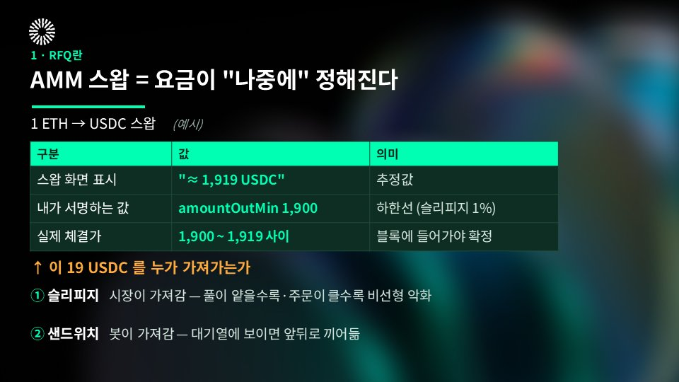

원인은 하나로 모입니다. **가격이 체결 이후에 정해진다는 것.**

---

## 2. RFQ는 이 순서를 뒤집는다

RFQ(Request for Quote)는 말 그대로 "호가를 요청"하는 방식입니다. 가격을 먼저 확정하고, 그다음에 체결합니다. 순서만 바꿨을 뿐인데 결과가 달라집니다.

**1단계 — 사용자가 요청합니다.**
"1,000 ETH를 USDC로 바꾸고 싶다." 오프체인 요청이라 가스는 0입니다.

**2단계 — RFQ 라우터가 마켓메이커들에게 호가를 받습니다.**

- MM A → 1,918.60 서명
- MM B → **1,919.35 서명** ← 최선
- MM C → 1,917.90 서명

사용자는 이 중 최선가에 EIP-712로 서명합니다. 여기까지도 가스가 0입니다.

**3단계 — 온체인에서 정산합니다.**
두 서명을 검증하고, 한 트랜잭션 안에서 맞교환합니다.

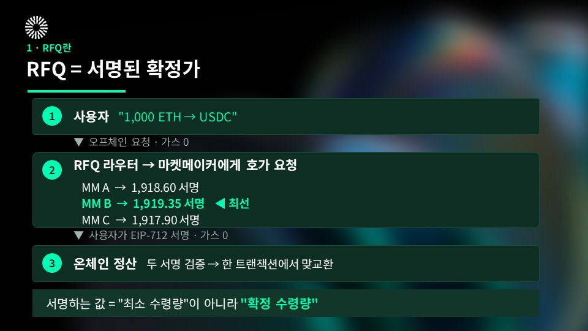

핵심은 2단계에 있습니다. 사용자가 서명하는 값이 <strong>"최소 수령량"이 아니라 "확정 수령량"</strong>입니다. amountOutMin이라는 하한선이 사라지고 숫자 하나만 남습니다.

슬리피지가 0인 이유이고, 샌드위치가 불가능한 이유입니다. 끼어들 틈 자체가 없으니까요.

---

## 3. RFQ는 블록체인이 발명한 게 아니다

여기서 오해가 자주 생깁니다. RFQ는 DeFi 신문물이 아닙니다. 전통 금융에서는 이미 오래된 표준입니다.

채권, FX, 옵션, 블록딜이 전부 RFQ로 돌아갑니다. 이 시장들에는 공통점이 있습니다. 호가창이 얇거나, 주문이 크거나, 상품이 비표준이라는 것.

한 문장으로 줄이면 <strong>"오더북에 그냥 걸면 불리해지는 주문"</strong>입니다. 그럴 때 딜러 몇 곳에 직접 물어보는 것, 그게 RFQ입니다.

블록체인은 이 개념을 발명한 게 아니라 **옮겨왔습니다.** 옮겨오면서 바뀐 건 정산 방식 하나입니다.

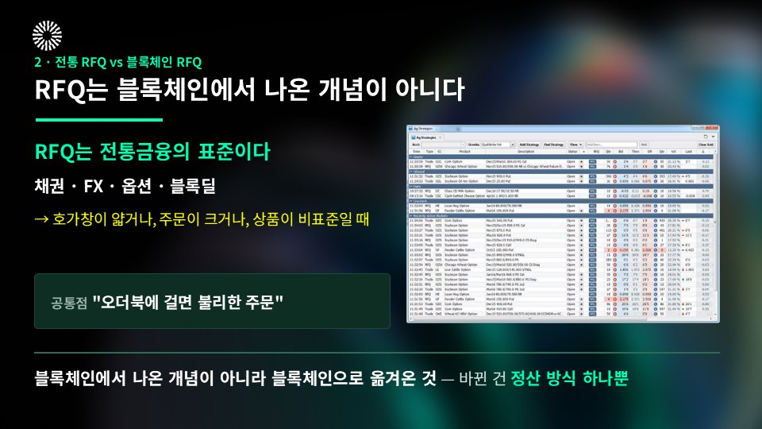

**전통 RFQ에서 온체인 RFQ로, 실제로 바뀐 것**

- **참여 자격** — 계좌 개설·심사 → **지갑만 있으면 됨**
- **상대방** — 딜러를 믿어야 함 → **믿을 필요가 없음**
- **결제** — T+1 / T+2 → **체결과 동시에 종료**
- **거래 실패** — 미결제 위험·분쟁 → **거래가 통째로 취소**
- **가동 시간** — 장중 → **24/7**
- **투명성** — 사후 보고 → **체결 내역 전부 공개**

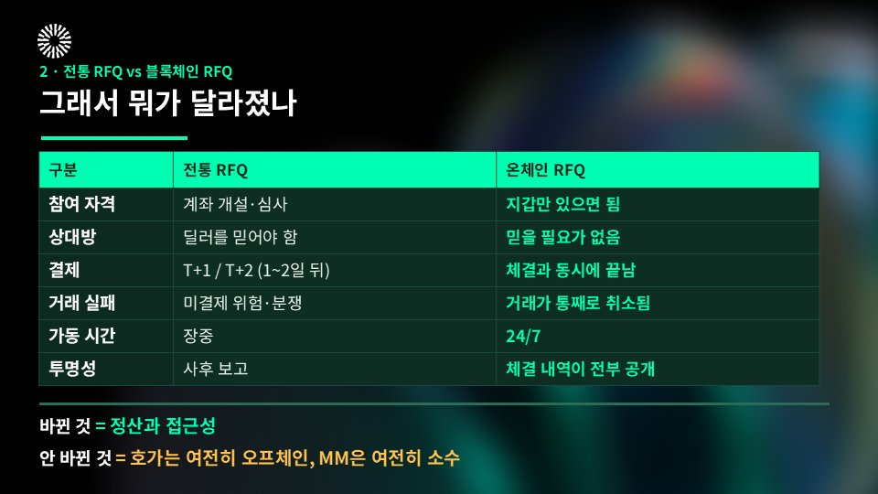

정리하면 <strong>바뀐 것은 정산과 접근성</strong>입니다.

그리고 <strong>안 바뀐 것</strong>이 더 중요합니다. 호가는 여전히 오프체인에서 만들어지고, 그 호가를 내는 MM은 여전히 소수입니다.

---

## 4. RFQ에 새 EIP는 없다 — 서명이 전부다

기술 스택을 보면 더 분명해집니다. RFQ는 새로운 EIP가 아니라 <strong>이미 있는 서명 표준의 조합</strong>입니다.

- **EIP-712** (Final) — 구조화 데이터 서명. 모든 서명 주문 시스템의 기반이고, 이게 없으면 RFQ도 없습니다.
- **EIP-2612** (Final) — ERC-20 permit. approve 트랜잭션을 없앱니다. 단, 토큰마다 구현이 들어가 있어야 씁니다.
- **Permit2** — Uniswap이 만든 컨트랙트. cf. 사실상 업계 표준처럼 쓰이지만 표준으로 등록된 적은 없습니다.
- **EIP-7702** (Final, Pectra) — 일반 지갑 주소(EOA)가 잠깐 컨트랙트처럼 동작하게 해줍니다. 승인과 스왑을 한 트랜잭션에 묶을 수 있습니다.
- **ERC-4337** (Final) — 계정 추상화. 지갑 자체를 컨트랙트로 만들어 가스 대납이나 서명 규칙 변경을 가능하게 합니다.

뒤의 두 개는 채택률을 직접 재봤습니다. 기대만큼은 아니었습니다.

<strong>EIP-7702는 메인넷 트랜잭션의 1.19%를 차지하는데, 정작 보내는 주체는 16곳뿐</strong>입니다. 비율은 잡히지만 쓰는 곳은 극소수라는 뜻이죠.

<strong>ERC-4337은 0.38%</strong>이고, 그마저 v0.6 / 0.7 / 0.8 세 버전으로 갈라져 있습니다.

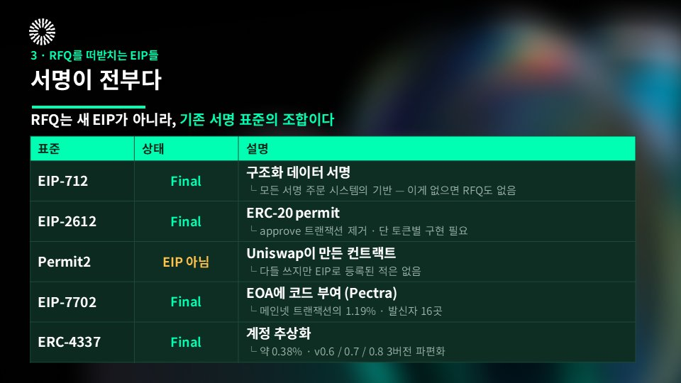

그래도 결론은 같습니다. RFQ를 붙인다는 건 새 프로토콜을 발명하는 일이 아닙니다. 서명 규격을 맞추고 정산 컨트랙트를 여는 일에 가깝습니다.

---

## 5. AMM · 온체인 CLOB · RFQ는 경쟁 관계가 아니다

세 방식은 **강한 자리가 서로 겹치지 않습니다.**

- **가격 결정** — 공식(x·y=k) / 지정가 주문장 / MM이 오프체인에서 계산해 서명
- **유동성** — LP 자본 락업 / 메이커 게시 / MM 재고(CEX 포함), 락업 불필요
- **슬리피지** — 규모에 비례 / 호가 깊이만큼 / **없음**
- **MEV** — 구조적으로 취약 / 프론트런 가능 / **샌드위치 불가**
- **가스** — 가장 저렴 / 주문·취소마다 발생 / **1.4\~2.3배 비쌈**
- **실패 비용** — 사용자 / 사용자 / **솔버·MM**
- **롱테일** — 강함 / 약함 / 약함
- **대형 주문** — 약함 / 중간 / **강함**
- **소액 주문** — 강함 / 중간 / 불리
- **탈중앙성** — 높음 / 높음 / **낮음**

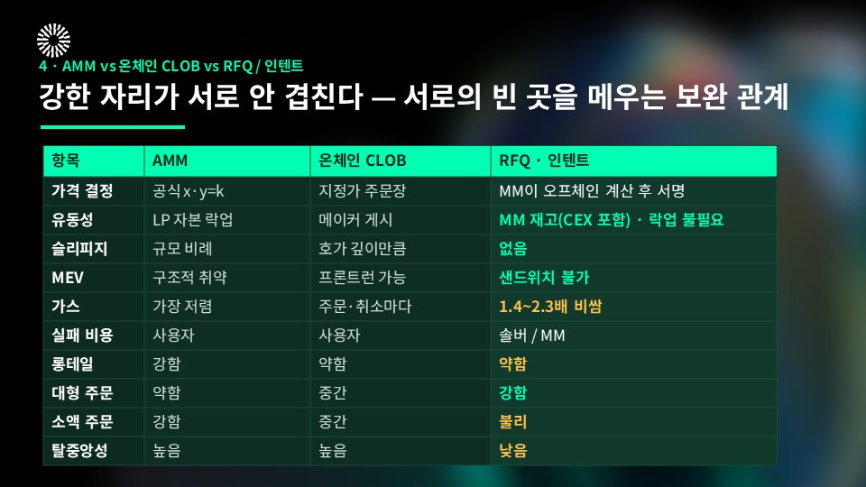

읽는 방향은 단순합니다. **대형·블루칩은 RFQ, 소액·롱테일은 AMM.**

실제로 0x 같은 애그리게이터는 한 거래 안에서 RFQ 경로와 AMM 경로를 섞어서 씁니다. RFQ가 AMM을 밀어내는 게 아니라 <strong>경로 중 하나</strong>로 들어가 있는 겁니다.

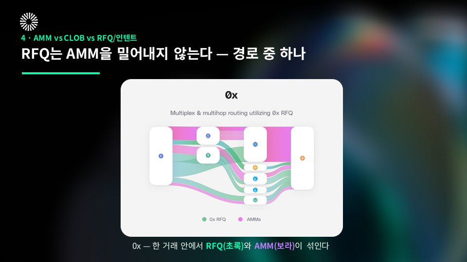

---

## cf. 인텐트와 RFQ는 다른 개념이다

자주 같이 묶이지만 다른 개념입니다.

- **RFQ** — "이 가격에 해주실 분?" → MM이 호가를 냅니다
- **인텐트** — "이 결과를 원한다" → 솔버가 직접 경로를 풉니다

CoW Swap의 배치옥션이 대표적입니다. 핵심 가치는 **Coincidence of Wants**, 서로 반대 방향 주문을 직접 매칭해서 AMM 없이 체결한다는 것입니다.

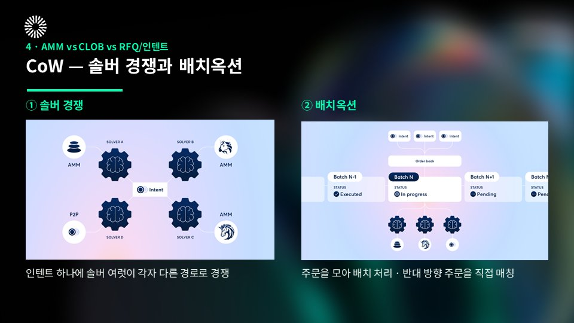

그래서 실제로 그렇게 되는지 직접 재봤습니다. 20시간 집계 결과입니다.

- 정산 트랜잭션 — **1,883건**
- Trade 이벤트 — **1,943건**
- 배치당 평균 — **1.03건** (중앙값 1, 최대 3)

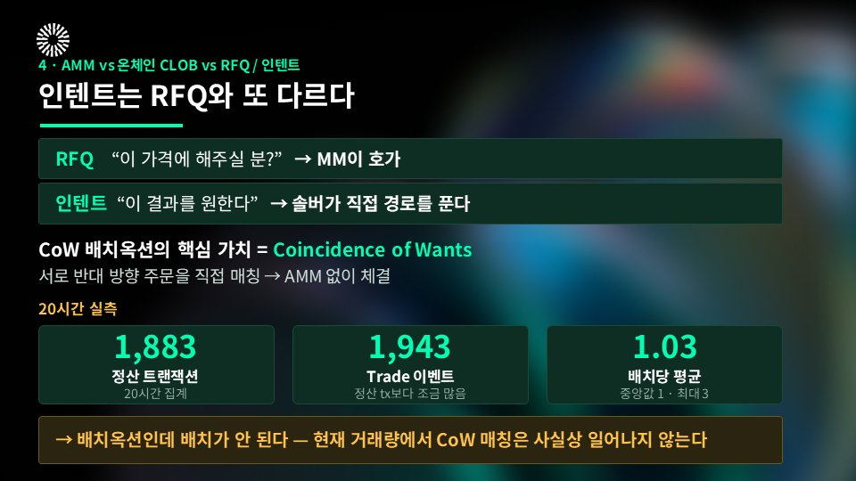

배치옥션인데 배치가 안 됩니다. 지금 거래량에서 CoW 매칭은 사실상 일어나지 않고 있습니다.

설계가 틀렸다는 얘기가 아닙니다. 그 설계가 작동하려면 지금보다 훨씬 두꺼운 주문 흐름이 필요하다는 뜻입니다.

---

## 6. 숫자로 보면 마케팅과 다른 지점이 세 곳 있다

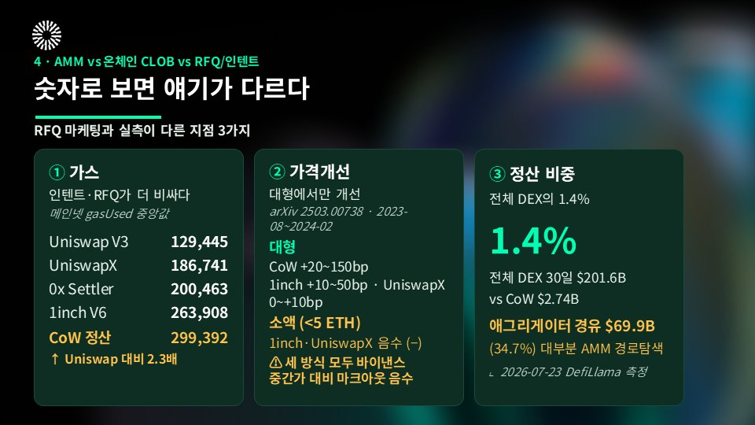

## ① 가스는 RFQ·인텐트가 오히려 비싸다

메인넷 gasUsed 중앙값 기준입니다.

- Uniswap V3 — **129,445**
- UniswapX — 186,741
- 0x Settler — 200,463
- 1inch V6 — 263,908
- CoW 정산 — **299,392**

CoW 정산은 Uniswap 대비 <strong>2.3배</strong>입니다. 가격을 개선해도 가스에서 다시 까입니다. 소액 구간에서 결과가 뒤집히는 이유가 여기 있습니다.

## ② 가격 개선은 대형에서만 나타난다

학술 측정(arXiv 2503.00738, 2023-08\~2024-02 구간) 기준입니다.

- **대형** — CoW +20\~150bp / 1inch +10\~50bp / UniswapX 0\~10bp
- **소액(5 ETH 미만)** — 1inch·UniswapX는 **음수(−)**

하나 더 짚고 가겠습니다. <strong>세 방식 모두 바이낸스 중간가 대비 마크아웃은 음수</strong>였습니다. DEX끼리 비교하면 개선이지만, 글로벌 최우선 호가와 견주면 여전히 뒤에 있다는 뜻입니다.

## ③ 정산 비중은 전체 DEX의 1.4%

2026년 7월 23일 DefiLlama 기준입니다.

- 전체 DEX 30일 거래량 — **$201.6B**
- CoW — **$2.74B**, 전체의 **1.4%**
- 애그리게이터 경유 — $69.9B (34.7%)

마지막 줄은 오해가 잦은 숫자라 하나 덧붙이겠습니다. **34.7%는 "인텐트 비중"이 아니라 라우터 경유율일 뿐이고, 그 대부분은 RFQ가 아니라 AMM 경로탐색입니다.**

여기에 0x Swap API 데이터(2025년 6\~8월)를 겹치면 그림이 선명해집니다. RFQ 점유율은 **블루칩 페어에서 40\~65%**, <strong>롱테일에서 10\~25%</strong>입니다.

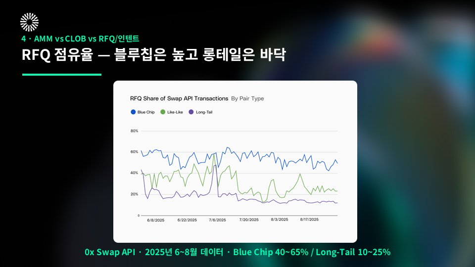

RFQ는 "전체"를 먹는 방식이 아닙니다. <strong>특정 구간</strong>을 먹는 방식입니다.

---

## 7. 규모로 보면 RFQ의 본류는 사실 CEX다

온체인 RFQ 얘기를 하다 보면 잊게 되는데, RFQ의 본진은 중앙화 거래소입니다.

- **Bybit RFQ** — 최소 $10,000. LP 최대 30곳에서 호가를 받아 상위 3개를 보여주고, 유효 시간 1분, 최대 25레그. **기관 전용이 아니라 리테일도 쓸 수 있습니다.**
- **Binance Convert** — 최소 <strong>1센트</strong>입니다. 이게 사실상 리테일 RFQ예요. 수수료 0, 슬리피지 0인데 마진은 이미 스프레드에 들어가 있는 구조입니다.
- **OKX** — 최소 $1,000. CeFi와 온체인 양쪽에서 RFQ를 운영하는 유일한 대형사입니다.
- **Deribit Block** — 최소 25 BTC. 2025년 3월 출시했고, 이후 Coinbase가 <strong>약 29억 달러</strong>에 인수를 완료했습니다. 업계 최대 규모 M&A였고, 인수 대상이 블록·RFQ 트레이딩 거래소였습니다.
- **Paradigm** — 거래소가 아니라 기관 유동성 네트워크입니다. 고객 자산을 절대 수탁하지 않고 협상·매칭만 하며, 정산은 Deribit이나 Bybit에서 일어납니다. <strong>RFQ를 레이어로 분리하면 이렇게 된다</strong>는 좋은 사례입니다. MM 50곳 이상, 카운터파티 1,000곳 이상.

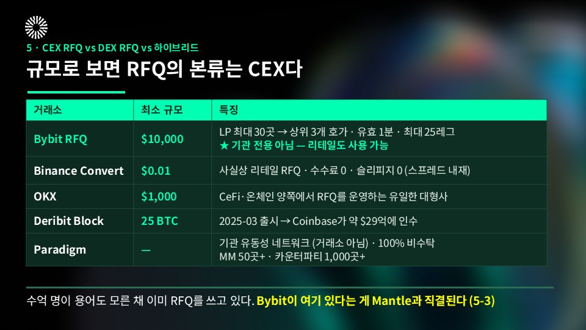

Binance Convert를 써본 적 있으시다면, 여러분은 이미 RFQ 사용자입니다. **수억 명이 용어도 모른 채 RFQ를 쓰고 있습니다.**

그리고 이 목록에 <strong>Bybit</strong>이 있다는 사실이 Mantle과 직결됩니다. 이유는 바로 다음 장에 있습니다.

---

## 8. 온체인 호가는 결국 CEX에서 나온다

온체인 RFQ가 실제로 어떻게 도는지 보겠습니다.

1. <strong>Taker가 호가를 요청</strong>합니다 (토큰쌍·규모·체인)
1. <strong>MM이 재고·헤지·리스크 한도로 가격을 산출</strong>합니다 — 풀 곡선이 아닙니다
1. <strong>MM이 서명된 페이로드를 반환</strong>합니다 (가격·규모·만료·nonce)
1. <strong>Taker가 서명해 제출</strong>하면 한 번에 맞교환됩니다 (슬리피지 0)
1. <strong>MM이 익스포저를 헤지</strong>합니다 — 보통 CEX에서

5번이 핵심입니다. **MM은 온체인에서 유동성을 조달하지 않습니다.** 자기 글로벌 북(CEX 현물·선물·옵션·OTC)을 기준으로 호가를 내고, 온체인에서는 정산만 합니다.

여기서 두 가지가 따라 나옵니다.

- MM은 **헤지할 수 있는 것만 호가합니다.** 헤지 시장이 없는 자산에는 호가가 아예 안 나옵니다.
- 따라서 <strong>Bybit에 해당 시장이 있다는 것 자체가 Mantle 온체인 RFQ 호가의 전제조건</strong>입니다.

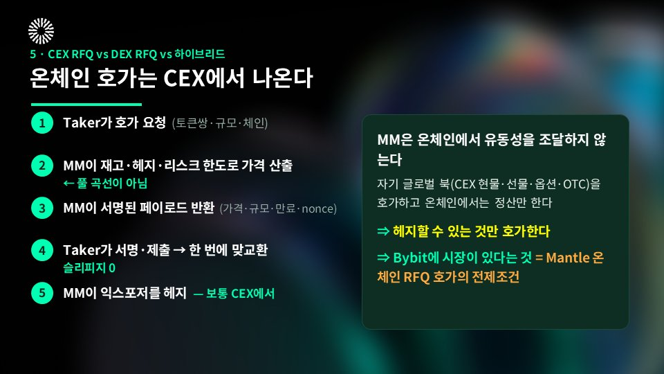

요구 스펙도 만만치 않습니다. OKX 온체인 PMM은 온체인 RFQ의 MM 요건을 공개한 거의 유일한 사례인데, 이렇습니다.

- 10초마다 실시간 가격 레벨 스트리밍
- 확정 호가 응답 **200ms** (최대 500ms)
- 응답 성공률 **90% 이상** 유지
- 온체인 체결률 **90% 이상** 유지
- 체결 주체는 Taker — MM 호가를 받아 사용자가 직접 서명·제출

<strong>200ms 안에 확정 호가를 낸다</strong>는 건 스마트컨트랙트 문제가 아닙니다. 트레이딩 인프라 문제입니다. 그래서 RFQ를 붙인다는 건 컨트랙트를 배포하는 일이 아니라, 그 인프라를 이미 굴리고 있는 팀을 데려오는 일에 가깝습니다.

참고로 온체인 RFQ 계열 30일 볼륨은 이렇습니다 (DefiLlama, 2026-07-23).

- Jupiter — $20.33B (메타옥션)
- 0x — $5.46B
- DFlow — $4.36B (주문흐름 경매)
- CoW — $2.74B
- Bebop — $1.33B
- Jupiter Z — $1.21B (순수 RFQ)
- Hashflow — $131M

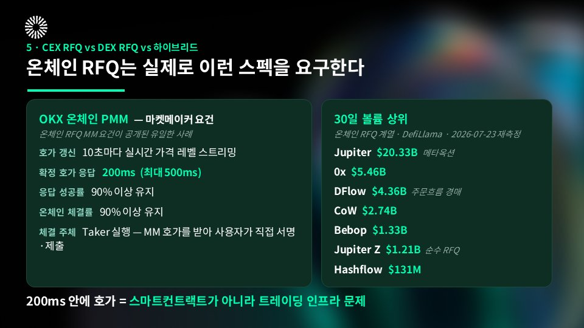

---

## 9. 그래서 Mantle은 지금 어디쯤 있나

## 이미 돌아가고 있는 것 — xChange Atomic RFQ

**xChange는 xStocks가 만든 시스템입니다.** _"xChange, xStocks's Atomic RFQ system"_.

<strong>Fluxion은 위 시스템이 돌아가는 베뉴</strong>입니다.

구조는 이렇습니다. 사용자가 <strong>복수 LP의 실시간 호가</strong>를 받아 xStocks 토큰을 직접 mint/redeem합니다. 발행사가 그 자리에서 발행·상환을 처리하니 <strong>AMM을 완전히 우회</strong>합니다.

<strong>왜 하필 주식에 RFQ냐</strong>가 중요합니다. 주식은 AMM으로 다루기 최악인 자산이기 때문입니다. AMM은 풀 안의 비율로 가격을 만드는데, **테슬라 주가는 나스닥에서 정해집니다.** 둘이 어긋나는 순간 차익거래자가 풀을 털어갑니다.

그래서 시간으로 나눴습니다.

- **장중** → 기초증권 실시간 호가에 앵커해서 RFQ로 체결
- **장마감** → AMM이 이어받아 24/7 유지

시간대로 두 방식이 교대하는 구조입니다. 이 구조는 UI에도 그대로 드러납니다. RFQ 탭에 **Expires in: 1H / 1D / 1W / Never** 설정이 있는데, "서명된 확정가에는 만료가 있다"는 개념이 화면에서는 이런 모습입니다.

그리고 호가 기준이 <strong>Bybit 오프체인 유동성</strong>입니다. 앞 장의 "MM은 헤지 가능한 것만 호가한다"가 그대로 구현된 사례죠.

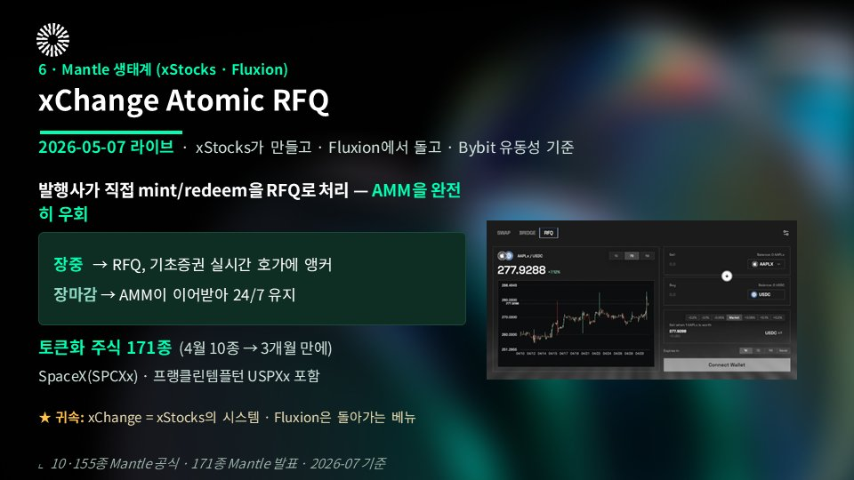

## 종목 수가 어떻게 늘었나

- **2026-04-10** — **10종** 출시 (TSLAx, NVDAx, AAPLx …) — Mantle H1 보도자료의 \_"first 10 tokenized U.S. equities"\_
- **2026-06-30** — **155종** — 같은 보도자료의 \_"155 tokenized equities live on Mantle"\_, Nansen Q2 2026 리포트에서도 확인
- **2026-07-22** — **171종** — @Mantle\_Official \_"171 tokenized equities on Mantle and growing"\_

**석 달 만에 17배입니다.** 그 사이에 들어온 게 5월 7일의 Atomic RFQ입니다.

이게 왜 중요하냐면, 만약 AMM으로 했다면 **종목 하나 늘릴 때마다 풀을 만들고 유동성을 채워야** 합니다. 171종이면 171개 풀을 채워야 해요. 그 돈을 다 어디서 구합니까.

**RFQ는 가격만 개선하는 게 아니라 상장 비용을 낮춥니다.** 슬리피지보다 이쪽이 더 큰 변화라고 봅니다.

cf. 위 수치는 전부 <strong>Mantle 기준</strong>이고, xStocks 전역 종목 수는 이와 별개로 훨씬 큽니다. 그리고 Fluxion 문서에 등재된 xStocks <strong>AMM 페어는 10종</strong>인데, 모순이 아니라 층이 다른 겁니다. AMM이 받쳐주는 게 10종, RFQ로 거래 가능한 게 171종입니다.

---

## 그런데 Mantle에서 "RFQ"라 불리는 건 사실 세 가지다

이름은 전부<strong> "RFQ"</strong>인데 서로 다른 개념이고, 상태도 다릅니다.

**① xChange Atomic RFQ — 가동 중** (2026-05-07\~)
위에서 설명한 그것입니다. xStocks가 만들었고, 발행사가 직접 발행·상환합니다.

**② Fluxion 리밋오더 — 초기 단계**
1inch LOP v4 포크입니다. **서명 주문이지 MM 호가가 아닙니다.** 2026-04-15 배포, 최근 체결은 07-16. 누적 1,744건, 명목 약 $91,800, taker 9명입니다 (온체인 직접 확인, 2026-07-22 기준).

**③ 딜러형 RFQ 오더북 — 상태 불명확**
MM이 확정 호가를 스트리밍하는, 이 글에서 계속 얘기한 그 형태입니다. 그런데 **설명이 자료마다 어긋납니다.**

2025년 12월 Fluxion 메인넷 출시 보도자료는 이 기능을 <em>"Orderbook & RFQ Layer (</em>_Upcoming_<em>)"</em>으로 적었습니다. 반면 다른 소개 자료들은 "V2/V3 AMM 풀과 고정밀 RFQ 오더북을 통합한 하이브리드 유동성 모델"이라고 <strong>완료형</strong>으로 씁니다. 자사 문서 안에서도 로드맵에는 취소선이 그어져 완료로 표시돼 있는데, 본문에는 "Once deployed…"가 남아 있어 미배포로 읽힙니다.

컨트랙트를 직접 확인하면 답은 분명합니다. Fluxion 공식 문서가 공개하는 컨트랙트는 <strong>AMM V2, AMM V3, 리밋오더 셋뿐</strong>입니다. **RFQ·오더북 컨트랙트 주소는 없습니다.** GitHub 조직도 레포가 5개인데 공개된 Solidity는 Uniswap V3 포크인 v3-core 하나뿐이고, RFQ 레포는 없습니다. 직접 확인해보고 싶으시면 Mantle 익스플로러에서 조회하실 수 있습니다.

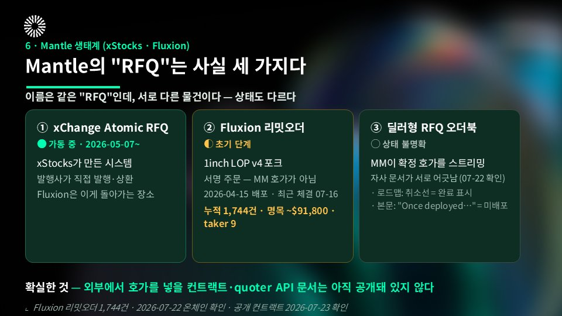

그러니까 **지금 여러분이 마켓메이커라서 Mantle에 호가를 넣고 싶어도, 어디에 붙어야 하는지 문서상 알 방법이 없습니다.**

반대로 보면 **그 문서를 만드는 일이 통째로 비어 있다는 뜻입니다.** 엔지니어링 과제가 아니라 문서화 과제입니다.

## 10. 재료는 있고, 문이 없다

**1) 이미 갖춰진 것** (2026-07-20 기준)

- **자산** — 스테이블코인 **$535.9M**, mETH **$476M**, MI4 **$116M** (DefiLlama 기준). DeFi TVL은 2분기에 <strong>$10억</strong>을 넘겼고, 상반기에만 **230% 늘었습니다** (Nansen Q2 2026 리포트)
- **RFQ** — xChange Atomic RFQ 가동 중 (5/7\~)
- **기술** — SP1 zkVM 기반 validity 롤업, 이더리움 DA. 같은 리포트 기준 **TVL 최대 ZK 롤업**(총 $20억 이상)입니다
- **성격** — Nansen은 Mantle을 <strong>"value-dense L2"</strong>로 규정했습니다 (Q1 2026 리포트). 고빈도 소액이 아니라 큰 거래 중심이라는 뜻이고, **RFQ가 가장 잘 맞는 플로우가 정확히 이겁니다**

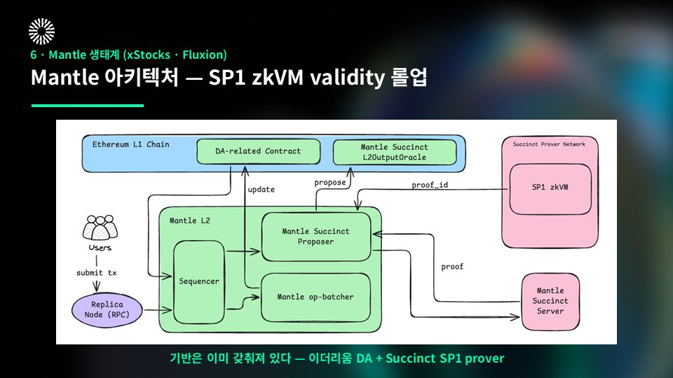

이 "성격"은 Q2 수치에서 더 분명해집니다. 2분기 **일일 활성 주소는 평균 약 1,590개**(1,033\~3,327), <strong>일일 트랜잭션은 약 81,000건</strong>이었습니다. 주소 수는 이 정도인데 그 위에 얹힌 자금은 $10억이 넘습니다. Nansen도 같은 리포트에서 이걸 "대중 소비자 네트워크가 아니라 DeFi 중심·기관급 L2"라고 정리했습니다. 지갑 수를 늘려서 만드는 시장이 아니라, <strong>한 건당 규모로 도는 시장</strong>이라는 얘기입니다.

**2) 아직 없는 것**

**① 외부 MM이 붙을 경로** — 앞에서 본 그대로입니다. quoter API 스펙도, RFQ 컨트랙트 문서도 아직 없습니다.

**② 마켓메이커 온보딩** — Grants에는 Flagship Buildathon과 Mantle Scouts 두 개뿐이고 MM 트랙이 없습니다. 유동성 프로그램으로는 <strong>MIP-28</strong>이 가결돼 있고 규모도 큽니다. 3억 USDx, 25만 ETH, 2천 BTC, 4억 MNT에 마켓뉴트럴 펀드 1억 달러. **그런데 이건 애플리케이션에 자본을 배치하는 프로그램이지, 호가를 낼 트레이딩 회사를 모집하는 장치가 아닙니다.**

2분기에 통과한 <strong>MIP-34</strong>도 같은 모양입니다. Aave DAO에 **3만 ETH**(당시 $68M\~$105M)를 36개월간 빌려주는 안인데, 조건은 Lido stETH 수익률 + 1%입니다. 규모로 보면 상당한 결정이지만, 자본이 향한 곳은 렌딩 프로토콜입니다. 돈은 있는데 그 돈을 MM에게 연결하는 창구가 없는 상태가 두 분기째 이어지고 있습니다.

**③ 시장 미시구조 거버넌스** — 2024년부터 지금까지 RFQ·인텐트·주문흐름·DEX 인센티브 설계에 관한 <strong>MIP가 0건</strong>입니다. 카탈로그를 봐도 비슷합니다. Mantle dApp 242개 중 DEX가 42개인데 RFQ/인텐트로 분류된 건 2개뿐이고, 하나는 Algebra라 사실상 오분류, 다른 하나인 IntentX는 올해 1월 8일에 종료했습니다. **실질적으로 0개입니다.**

나쁜 신호이자 동시에 기회입니다. 아무도 아직 안 했다는 뜻이니까요.

거래층 자체도 아직 얇습니다. 30일 DEX 거래량 **$42.75M**, 라우터 경유율 <strong>14.5%</strong>입니다. 이더리움 58%, 솔라나 55%와 비교하면 확실히 낮습니다. \_(2026-07-20 DefiLlama 기준. 이 지표는 하루 스파이크에 크게 흔들려서, 직접 보실 때는 24h·7d·30d를 같이 확인하셔야 합니다.)\_

Nansen이 집계한 2분기 DEX 활동도 같은 그림입니다. AGNI 51,000건, Bybit 44,000건, Merchant Moe는 10,500건에 <strong>이용자 1,011명</strong>이었습니다. 자금 규모에 비하면 거래를 실제로 치는 손이 아직 적습니다.

그래도 저는 이걸 나쁜 신호로 보지 않습니다. **아무것도 없는 곳에서 시작하는 것보다, 돈이 이미 있는 곳에 거래 인프라를 붙이는 게 훨씬 쉽습니다.**

그리고 후보도 이미 생태계 안에 있습니다. Flowdesk(xStocks MM), SpotSpreads, Rivera Money, Native, VOOI. 여기에 Nordstern이 "1inch·CoW 최상위 솔버"를 표방하면서 Mantle을 이미 서빙하고 있습니다. **전문 솔버 인프라는 이미 닿아 있습니다.**

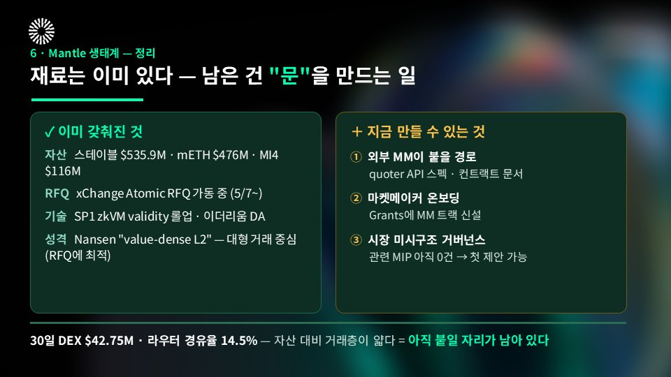

---

## 정리

**① RFQ는 만능이 아니라 조건부입니다.**
대형·블루칩·MM이 헤지할 수 있는 자산에서만 유리합니다. 소액과 롱테일은 여전히 AMM이 낫습니다.

**② 탈중앙인 것은 정산뿐, 가격 형성은 아닙니다.**
온체인 호가의 뿌리는 마켓메이커의 CEX 북입니다. Bybit에 시장이 있다는 것이 Mantle RFQ의 전제조건입니다.

**③ RFQ는 상장 비용을 낮춥니다.**
발행사가 직접 mint/redeem하면 풀 없이 종목을 얹을 수 있습니다. Mantle 토큰화 주식이 10종에서 171종이 되는 데 석 달 걸렸습니다.

**④ Mantle은 재료가 있고 문이 없습니다.**
자산도, 가동 중인 RFQ도, 기술도 갖춰졌습니다. RFQ quoter 문서, MM 온보딩 트랙, 시장 미시구조 MIP는 아직 없습니다.

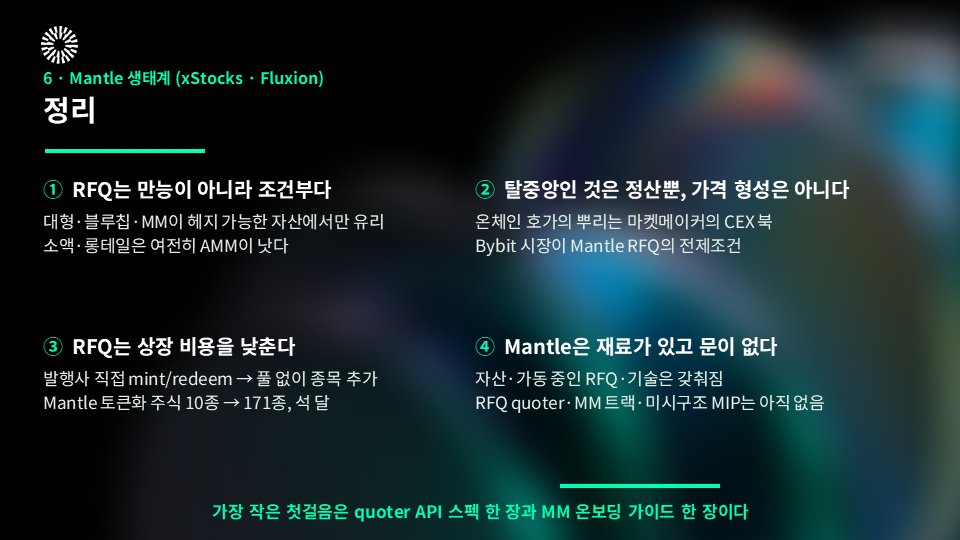

---

## 측정 기준과 출처

- **자체 측정 (2026-07-20)** — CoW 배치 20시간 집계, 메인넷 gasUsed 중앙값, EIP-7702·ERC-4337 채택률
- **온체인 직접 확인 (2026-07-22)** — Fluxion 리밋오더 누적 체결·명목·taker 수, 공개 컨트랙트 목록 · Mantle 익스플로러 / Fluxion GitHub
- **DefiLlama** — Mantle 자산·DEX 거래량·라우터 경유율(07-20), 전체 DEX 거래량·CoW 정산 비중·온체인 RFQ 계열 볼륨(07-23)
- **arXiv 2503.00738** — 가격 개선 및 마크아웃 (데이터 구간 2023-08\~2024-02)
- **0x Swap API** — 페어 유형별 RFQ 점유율 (2025년 6\~8월)
- **보도자료** — Fluxion 메인넷 출시(2025-12-18) · xChange Atomic RFQ(2026-05-07) · Mantle H1(2026-07-02)
- **@Mantle\_Official** (2026-07-22) — 토큰화 주식 171종
- **Nansen** — Q1 2026 리포트("value-dense L2"), Q2 2026 리포트(토큰화 주식 155종, DeFi TVL·일일 활성 주소·DEX 활동, MIP-34)
- **각 거래소 공개 문서** — Bybit RFQ, Binance Convert, OKX 온체인 PMM, Deribit 인수, Paradigm

---

세션에서 다 다루지 못한 표와 원본 슬라이드가 궁금하시면 편하게 댓글 남겨주세요.

— 맨틀 KR 데브렐 Kyle
